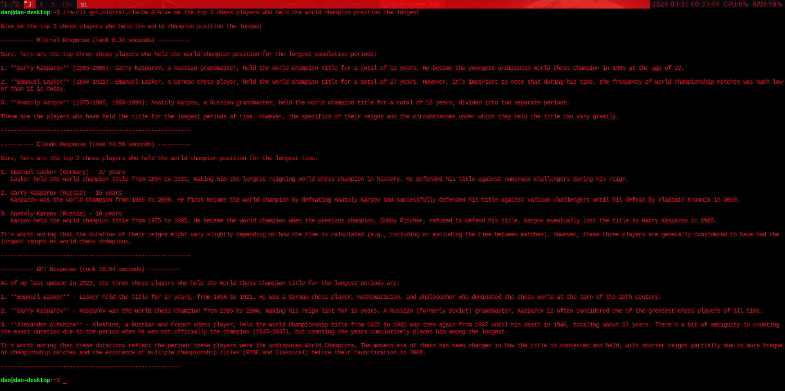

# About

This CLI app provides you with a way to interact with different LLMs.

Currently **GPT**, **Claude** and **Mistral** are supported (As soon as Gemini is available in Germany, I will also add Gemini). 

For now, only simple messages are supported, but I may add context as well, so your previous messages will be sent along with the new one to have a real conversation with the LLM.

## Installation

This app works on **Linux** and **MacOS**. If you made the mistake of using Windows, you can try to figure out yourself how to install it correctly or start using an OS that will not shut down for an update whenever it feels like.

The installation also assumes that you have **Git**, **Rust** and **Make** installed.  
If you dont have Rust installed, you can do so with 
```bash
curl --proto '=https' --tlsv1.2 https://sh.rustup.rs -sSf | sh
```

To install this app:

```bash
git clone https://github.com/QuodEstDubitandum/llm-cli.git 
cd llm-cli
sudo -E make install # we use -E to find cargos path correctly
```

To uninstall this app, just run 
```bash
sudo make uninstall
```

## Usage 

In your terminal, you can use the `llm-cli` command as following:

```bash
<model-name> <paramaters> $ <your-prompt>

# example: claude -temp=0.5 $ give me 20 places to visit in Tokyo
```

You can even ask multiple LLM models in **parallel** to compare responses and computing times (though you cant specify custom parameters this way, read below):

```bash
llm-cli <model-names-seperated-by-comma> $ <your-prompt>

# example: llm-cli gpt,claude,mistral $ give me 20 places to visit in Tokyo
```

### Parameters

When you install the app, a config file gets places into your `/etc` directory with default parameters. 

If you dont provide custom parameters, the app will always use the default ones from the file. But you can override the files parameters or use custom ones in the prompt as following: 

```bash
-temp=x     where x should be between 0 and 1 in typical LLM convention
-model=x    where x describes the model name such as gpt-4-0125-preview
-token=x    where x is the max_tokens property used in most LLMs
```

### API Key

You have to set an API Key for each model you want to be able to use. This is done in the config file. Just edit the json file in `/etc/llm_cli_config.json` and paste your API Key into the api_key field of the respective model.

## Example


*The LLMs seem to have different opinions on who held the chess title the longest, I actually did not know about Alekhine at all.*
